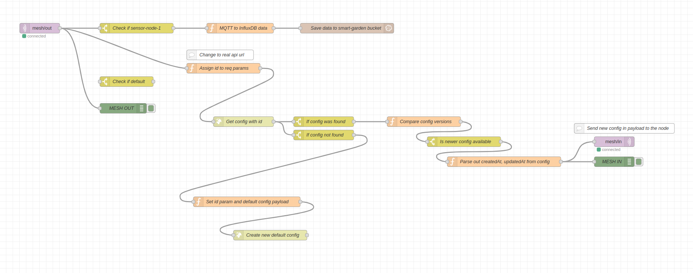
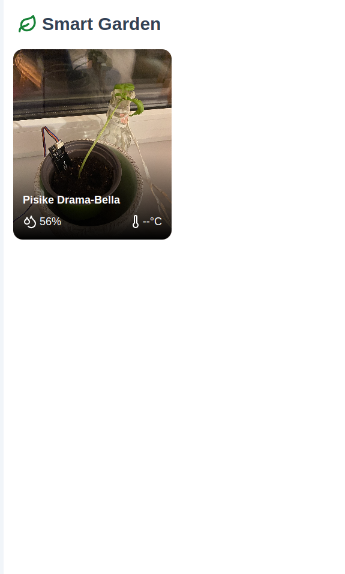
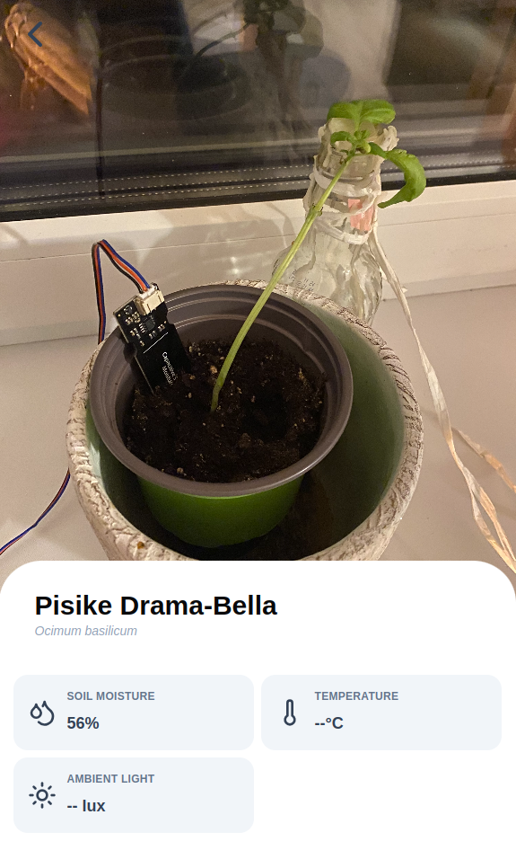
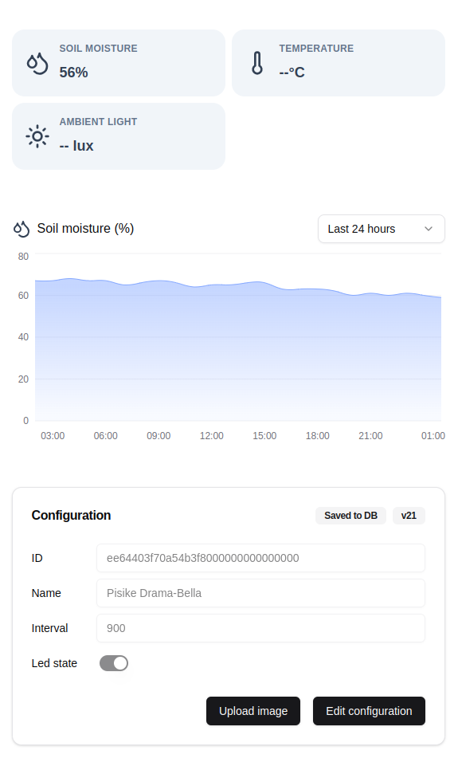

# Smart Garden: Implementing a Distributed Plant Monitoring System with ESP32 Mesh Networks

This project presents a scalable plant monitoring system that leverages ESP32 microcontrollers in a mesh network configuration. The system combines networked sensor nodes, distributed message routing, and modern web technologies to create a robust solution for automated plant care monitoring.

## System Architecture

The system implements a layered architecture built on the zh_network library by Alexander Zholtikov ([github.com/aZholtikov/zh_network](https://github.com/aZholtikov/zh_network)). This library provides the underlying ESP-NOW protocol management that enables reliable mesh network communication between nodes.

## Message Protocol

The system defines two primary message structures for communication across the mesh network:

```cpp
typedef struct __attribute__((packed)) {
    uint8_t id[16];        // Unique node identifier
    uint16_t moisture;     // Current soil moisture reading
    uint16_t version;      // Configuration version
} sensor_node_message;

typedef struct __attribute__((packed)) {
    uint8_t id[16];        // Node identifier
    uint16_t version;      // Configuration version
    uint16_t interval;     // Measurement interval
    bool led_state;        // Debug indicator status
} node_config;
```

These carefully designed structures ensure efficient message transmission while maintaining all necessary information for system operation. The packed attribute optimizes memory usage and ensures consistent byte alignment across different ESP32 devices.

## Node Types and Roles

The system consists of four distinct node types, each serving a specific purpose in the network:

The sensor nodes connect directly to capacitive moisture sensors for plant monitoring. While currently USB-powered, they're designed with future battery operation in mind, incorporating deep sleep capabilities and power-efficient operation modes. Each sensor node maintains its configuration in non-volatile storage and generates a unique UUID on first boot.

The relay nodes serve as message forwarders in the mesh network. Their implementation is deliberately simple - they receive messages and rebroadcast them, extending the network's effective range. This straightforward approach ensures messages can reach nodes that aren't within direct communication range of each other.

The master node acts as a bridge between the mesh network and the gateway, implementing bidirectional UART communication. It handles protocol translation between ESP-NOW and UART, ensuring reliable data flow between the two network segments.

The gateway node provides connectivity to the IP network, managing WiFi connections and implementing MQTT protocol support for integration with the broader system infrastructure.

## Data Processing Pipeline

When a sensor node takes a measurement, it packages the data into a sensor_node_message structure and broadcasts it through the mesh network. This message propagates through relay nodes until reaching the master node, which forwards it via UART to the gateway for MQTT publication.

The Node-RED implementation orchestrates the system's data flow and configuration management. When a message arrives on the "mesh/out" topic, Node-RED processes the sensor data for InfluxDB storage while simultaneously checking configuration versions. For each incoming sensor message, it queries the backend API with the node's ID to compare configuration versions. When it detects a version mismatch, it automatically publishes an updated node_config message to the "mesh/in" topic.

This configuration management includes automatic provisioning for new nodes. When Node-RED encounters an unknown node ID, it generates a default configuration with a 10-minute measurement interval and LED debugging disabled. The new configuration propagates through the network following the same path as sensor data, but in reverse.



## User Interface

The frontend application provides a clean interface for monitoring and managing the Smart Garden system. Built with React and Next.js, it displays the current state of all connected plants and allows users to manage sensor node configurations.



Each plant in the system has an associated sensor node configuration where users can assign a name and upload an image for easy identification. The interface allows users to view and modify these configurations, with changes automatically propagating through the mesh network to reach the appropriate sensor nodes.



The interface presents moisture data through charts that visualize historical trends across different time scales - daily, weekly, and monthly. This helps users track their plants' moisture levels over time and understand watering patterns.



The configuration interface allows users to adjust:
- Measurement intervals for each sensor
- LED indicator settings for debugging
- Plant names and images

## Data Storage

The system employs two specialized databases: InfluxDB for time-series sensor data and SQLite for configuration state and metadata. This separation allows each database to handle its specific task efficiently while maintaining system coherence through Node-RED's orchestration.

## Implementation Details

The complete system spans three GitHub repositories:
- Frontend (React/Next.js/Tailwind): [github.com/traaga/smart-garden-ui](https://github.com/traaga/smart-garden-ui)
- Backend (Node.js/Express): [github.com/traaga/smart-garden-api](https://github.com/traaga/smart-garden-api)
- ESP32 Firmware: [github.com/traaga/smart-garden](https://github.com/traaga/smart-garden)

The hardware implementation currently uses USB-powered ESP32 development boards with capacitive soil moisture sensors. While future iterations will incorporate battery power for sensor nodes, the current setup focuses on establishing reliable communication and measurement protocols.

## Future Development

Planned enhancements include:
- Battery power implementation for sensor nodes
- Automated irrigation control
- Additional environmental sensors
- TypeScript backend migration
- Real-time monitoring capabilities
- Plant care recommendations and guidelines
- Automated watering suggestions based on moisture trends
- Push notifications for critical moisture levels

The system demonstrates practical application of distributed systems principles in IoT contexts, providing a robust foundation for plant monitoring while maintaining flexibility for future enhancements.

# Setup

## Configuration

Create a `secrets.h` file in the `gateway-node/src/` folder with your WiFi credentials:

```cpp
#define WIFI_SSID "your_wifi_name"
#define WIFI_PASSWORD "your_wifi_password"
```
